<h2>
EfficientDet-Slightly-Realistic-USARoadSigns (Updated: 2022/04/04)
</h2>

This is a slightly realistic project to train and detect RoadSigns in US based on 
<a href="https://github.com/google/automl/tree/master/efficientdet">Google Brain AutoML efficientdet</a>.
 
Please also refer to our experimental project <a href="https://github.com/atlan-antillia/EfficientDet-USA-RoadSigns">EfficientDet-USA-RoadSigns</a>.
 

<h3>
1. Installing tensorflow on Windows10
</h3>
We use Python 3.8.10 to run tensoflow 2.4.2 on Windows10. 
At first, please install <a href="https://visualstudio.microsoft.com/ja/vs/community/">Microsoft Visual Studio Community</a>, which can be used to compile source code of 
<a href="https://github.com/cocodataset/cocoapi">cocoapi</a> for PythonAPI. 
Subsequently, please create a working folder "c:\google" folder for your repository, and install the python packages. 

<pre>
>mkdir c:\google
>cd    c:\google
>pip install -r requirements.txt
>git clone https://github.com/cocodataset/cocoapi
>cd cocoapi/PythonAPI
</pre>
You have to modify extra_compiler_args in setup.py in the following way: 
   extra_compile_args=[],
<pre>
>python setup.py build_ext install
</pre>

 
 
<h3>
2. Installing EfficientDet-Realistic-USA-RoadSigns
</h3>
Please clone EfficientDet-USA-RoadSigns in the working folder <b>c:\google</b>. 
<pre>
>git clone  https://github.com/atlan-antillia/EfficientDet-Realistic-USA-RoadSigns.git 
</pre>
You can see the following folder <b>projects</b> in  EfficientDet-USA-RoadSigns folder of the working folder. 

<pre>
EfficientDet-Realistic-USA-RoadSigns
└─projects
    └─USA_RoadSigns
        ├─saved_model
        │  └─variables
        ├─usa_virtual_test_dataset
        ├─usa_virtual_test_dataset_outputs
        ├─train
        ├─valid
        └─__pycache__
</pre>
 
<b>Note:</b> 
 You can download USA_RoadSigns tfrecord dataset from  
 <a href="https://github.com/sarah-antillia/TFRecord_Realistic_USA_RoadSigns">TFRecord_Realistic_USA_RoadSigns</a>
 

<h3>3. Inspect tfrecord</h3>
  You can use <a href="https://github.com/sarah-antillia/TFRecordInspector">TFRecordInspector</a> to inspect train and valid tfrecods. 
Run the following command to inspect train.tfreord. 
<pre>
>python TFRecordInspector.py ./projects/USA_RoadSigns/train/train.tfrecord ./projects/USA_RoadSigns/label_map.pbtxt ./inspector/train
</pre>
  
This will generate annotated images with bboxes and labels from the tfrecord, and cout the number of annotated objects in it. 
 
<b>TFRecordInspecotr: annotated images in train.tfrecord</b> 
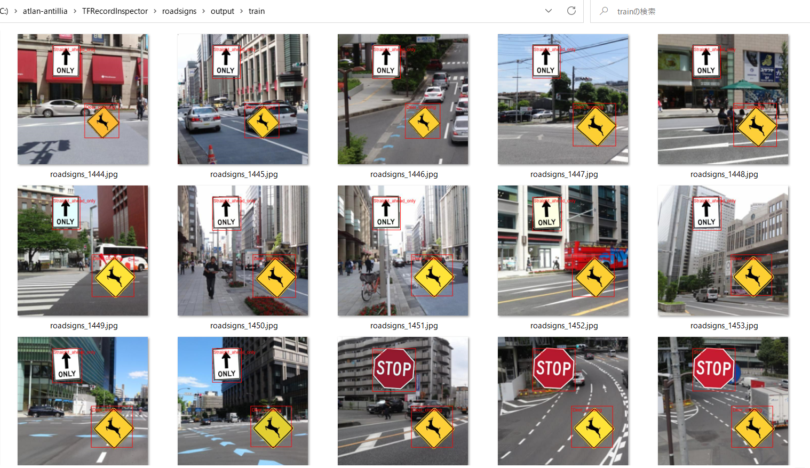
 
 
<b>TFRecordInspecotr: objects_count train.tfrecord</b> 
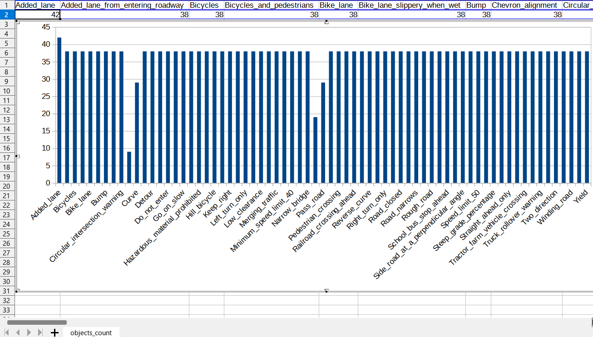
 
This bar graph shows that the number of the objects contained in train.tfrecord.
 
 
 
<h3>4. Downloading the pretrained-model efficientdet-d0</h3>
Please download an EfficientDet model chekcpoint file <b>efficientdet-d0.tar.gz</b>, and expand it in <b>EfficientDet-USA-RoadSigns</b> folder. 
 
https://storage.googleapis.com/cloud-tpu-checkpoints/efficientdet/coco2/efficientdet-d0.tar.gz
 
See: https://github.com/google/automl/tree/master/efficientdet 

<h3>5. Training USA RoadSigns Model by using pretrained-model</h3>
We use the usa_roadsigns_train.bat file.
We created a main2.py from main.py to be able to write COCO metrics to a csv files. 

<pre>
python main2.py ^
  --mode=train_and_eval ^
  --train_file_pattern=./projects/USA_RoadSigns/train/*.tfrecord  ^
  --val_file_pattern=./projects/USA_RoadSigns/valid/*.tfrecord ^
  --model_name=efficientdet-d0 ^
  --hparams="input_rand_hflip=False,image_size=512,label_map=./projects/USA_RoadSigns/label_map.yaml" ^
  --model_dir=./projects/USA_RoadSigns/models ^
  --label_map_pbtxt=./projects/USA_RoadSigns/label_map.pbtxt ^
  --eval_dir=./projects/USA_RoadSigns/eval ^
  --ckpt=efficientdet-d0  ^
  --train_batch_size=4 ^
  --early_stopping=map ^
  --patience=10 ^
  --eval_batch_size=1 ^
  --eval_samples=1000  ^
  --num_examples_per_epoch=2000 ^
  --num_epochs=300   

</pre>

<table style="border: 1px solid #000;">
<tr>
<td>
--mode</td><td>train_and_eval</td>
</tr>
<tr>
<td>
--train_file_pattern</td><td>./projects/USA_RoadSigns/train/train.tfrecord</td>
</tr>
<tr>
<td>
--val_file_pattern</td><td>./projects/USA_RoadSigns/valid/valid.tfrecord</td>
</tr>
<tr>
<td>
--model_name</td><td>efficientdet-d0</td>
</tr>
<tr><td>
--hparams</td><td>"input_rand_hflip=False,image_size=512,label_map=./projects/USA_RoadSigns/label_map.yaml"
</td></tr>
<tr>
<td>
--model_dir</td><td>./projects/USA_RoadSigns/models</td>
</tr>
<tr><td>
--label_map_pbtxt</td><td>./projects/USA_RoadSigns/label_map.pbtxt
</td></tr>

<tr><td>
--eval_dir</td><td>./projects/USA_RoadSigns/eval
</td></tr>

<tr>
<td>
--ckpt</td><td>efficientdet-d0</td>
</tr>
<tr>
<td>
--train_batch_size</td><td>4</td>
</tr>
<tr>
<td>
--early_stopping</td><td>map</td>
</tr>
<tr>
<td>
--patience</td><td>10</td>
</tr>

<tr>
<td>
--eval_batch_size</td><td>1</td>
</tr>
<tr>
<td>
--eval_samples</td><td>1000</td>
</tr>
<tr>
<td>
--num_examples_per_epoch</td><td>2000</td>
</tr>
<tr>
<td>
--num_epochs</td><td>300</td>
</tr>
</table>
 
 
<b>label_map.yaml</b>
<pre>
1: 'Added_lane'
2: 'Added_lane_from_entering_roadway'
3: 'Bicycles'
4: 'Bicycles_and_pedestrians'
5: 'Bike_lane'
6: 'Bike_lane_slippery_when_wet'
7: 'Bump'
8: 'Chevron_alignment'
9: 'Circular_intersection_warning'
10: 'Cross_roads'
11: 'Curve'
12: 'Deer_crossing'
13: 'Detour'
14: 'Dip'
15: 'Do_not_enter'
16: 'Do_not_rive_on_tracks'
17: 'End_detour'
18: 'Go_on_slow'
19: 'Hairpin_curve'
20: 'Hazardous_material_prohibited'
21: 'Hazardous_material_route'
22: 'Hill_bicycle'
23: 'Keep_left'
24: 'Keep_right'
25: 'Lane_ends'
26: 'Left_turn_only'
27: 'Left_turn_or_straight'
28: 'Low_clearance'
29: 'Merge'
30: 'Merging_traffic'
31: 'Metric_low_clearance'
32: 'Minimum_speed_limit_40'
33: 'Minimum_speed_limit_60km'
34: 'Narrow_bridge'
35: 'Night_speed_limit_45'
36: 'Night_speed_limit_70km'
37: 'No_bicycles'
38: 'No_large_trucks'
39: 'No_left_or_u_turn'
40: 'No_left_turn'
41: 'No_parking'
42: 'No_pedestrian_crossing'
43: 'No_right_turn'
44: 'No_straight_through'
45: 'No_turns'
46: 'No_u_turn'
47: 'One_direction'
48: 'Parking_with_time_restrictions'
49: 'Pass_on_either_side'
50: 'Pass_road'
51: 'Path_narrows'
52: 'Pedestrian_crossing'
53: 'Railroad_crossing'
54: 'Railroad_crossing_ahead'
55: 'Reserved_parking_wheelchair'
56: 'Reverse_curve'
57: 'Reverse_turn'
58: 'Right_turn_only'
59: 'Right_turn_or_straight'
60: 'Road_closed'
61: 'Road_closed_ahead'
62: 'Road_narrows'
63: 'Road_slippery_when_wet'
64: 'Rough_road'
65: 'School_advance'
66: 'School_bus_stop_ahead'
67: 'Sharp_turn'
68: 'Side_road_at_an_acute_angle'
69: 'Side_road_at_a_perpendicular_angle'
70: 'Speed_limit_50'
71: 'Speed_limit_80km'
72: 'Steep_grade'
73: 'Steep_grade_percentage'
74: 'Stop'
75: 'Straight_ahead_only'
76: 'Tractor_farm_vehicle_crossing'
77: 'Truck_crossing'
78: 'Truck_crossing_2'
79: 'Truck_rollover_warning'
80: 'Truck_speed_Limit_40'
81: 'Two_direction'
82: 'Two_way_traffic'
83: 'T_roads'
84: 'Winding_road'
85: 'Yield'
86: 'Y_roads'
</pre>
 
 
 
<b>COCO meticss f and map</b> 
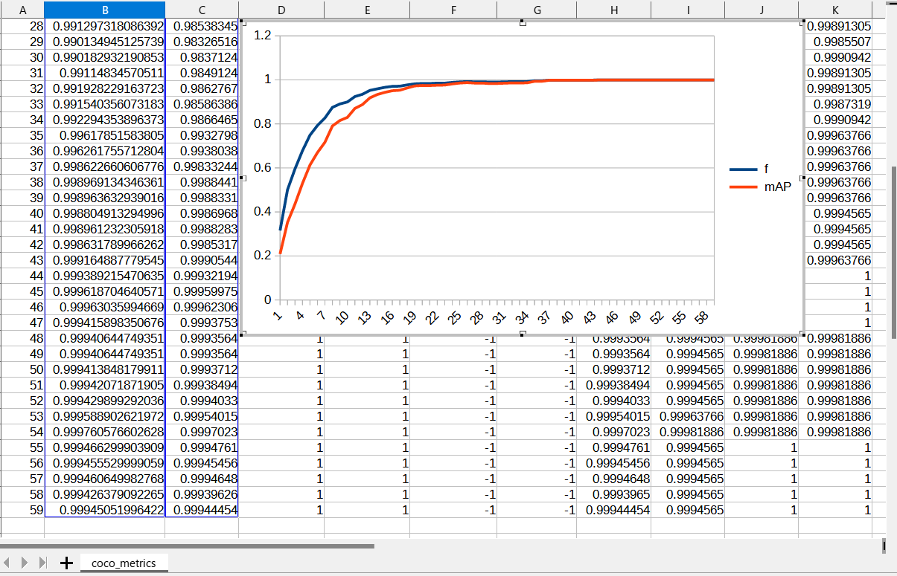
 
 
<b>Train losses at epoch</b> 

 
 
<!--
<b>COCO ap per class at epoch</b> 

 
 
 
-->
<h3>
6. Create a saved_model from the checkpoint
</h3>
 We use the following usa_roadsigns_create_saved_model.bat file.
<pre>
  python model_inspect.py ^
  --runmode=saved_model ^
  --model_name=efficientdet-d0 ^
  --ckpt_path=./projects/USA_RoadSigns/models  ^
  --hparams="image_size=512x512" ^
  --saved_model_dir=./projects/USA_RoadSigns/saved_model
 
</pre>

<table style="border: 1px solid #000;">
<tr>
<td>--runmode</td><td>saved_model</td>
</tr>

<tr>
<td>--model_name </td><td>efficientdet-d0 </td>
</tr>

<tr>
<td>--ckpt_path</td><td>./projects/USA_RoadSigns/models</td>
</tr>

<tr>
<td>--hparams</td><td>"image_size=512x512" </td>
</tr>

<tr>
<td>--saved_model_dir</td><td>./projects/USA_RoadSigns/saved_model</td>
</tr>
</table>

 
 
<h3>
7. Detect USA_road_signs by using a saved_model
</h3>
 We use the following usa_roadsigns_detect.bat file.
<pre>
  python model_inspect.py ^
  --runmode=saved_model_infer ^
  --model_name=efficientdet-d0 ^
  --saved_model_dir=./projects/USA_RoadSigns/saved_model ^
  --min_score_thresh=0.3 ^
  --hparams="image_size=1280x720,label_map=./projects/USA_RoadSigns/label_map.yaml" ^
  --input_image=./projects/USA_RoadSigns/usa_virtual_test_dataset/*.jpg ^
  --output_image_dir=./projects/USA_RoadSigns/usa_virtual_test_datasset_outputs
</pre>

<table style="border: 1px solid #000;">
<tr>
<td>--runmode</td><td>saved_model_infer </td>
</tr>

<tr>
<td>--model_name</td><td>efficientdet-d0 </td>
</tr>

<tr>
<td>--saved_model_dir</td><td>./projects/USA_RoadSigns/saved_model </td>
</tr>

<tr>
<td>--min_score_thresh</td><td>0.3 </td>
</tr>

<tr>
<td>--hparams</td><td>"label_map=./projects/USA_RoadSigns/label_map.yaml"</td>
</tr>

<tr>
<td>--input_image</td><td>./projects/USA_RoadSigns/usa_virtual_test_dataset/*.jpg  </td>
</tr>

<tr>
<td>--output_image_dir</td><td>./projects/USA_RoadSigns/usa_virtual_test_datasset_outputs</td>
</tr>
</table>
 
<h3>
8. Some detection results of USA RoadSigns
</h3>

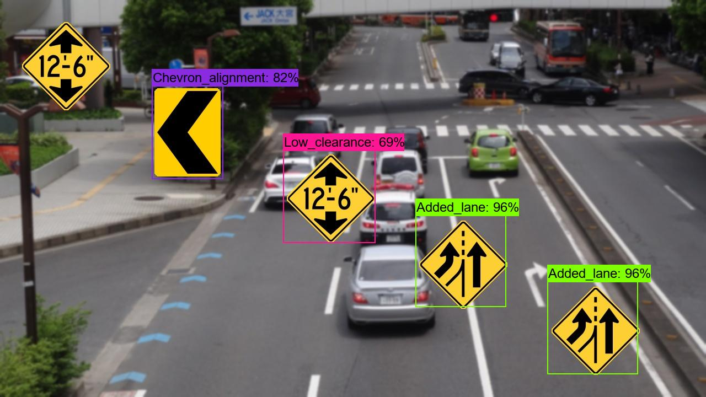 
<a href="./projects/USA_RoadSigns/usa_virtual_test_datasset_outputs/roadsigns101.jpg_objects.csv">roadsigns101.jpg_objects.csv</a> 
 
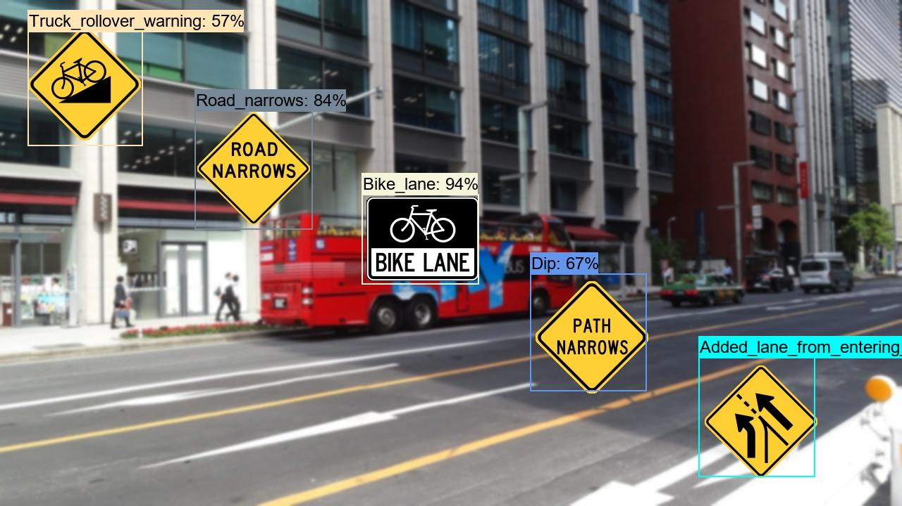 
<a  href="./projects/USA_RoadSigns/usa_virtual_test_datasset_outputs/roadsigns102.jpg_objects.csv">roadsigns102.jpg_objects.csv</a> 
 
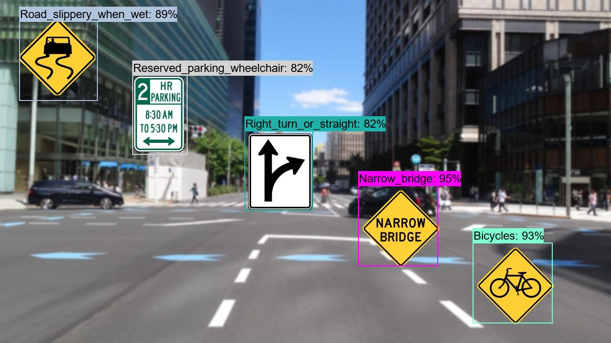 
<a  href="./projects/USA_RoadSigns/usa_virtual_test_datasset_outputs/roadsigns103.jpg_objects.csv">roadsigns103.jpg_objects.csv</a> 
 
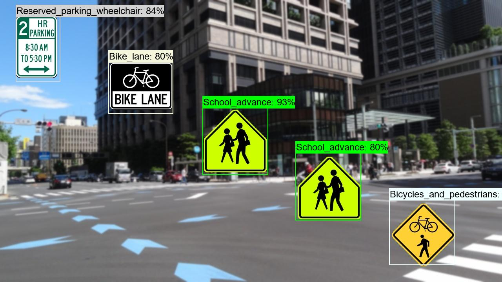 
<a  href="./projects/USA_RoadSigns/usa_virtual_test_datasset_outputs/roadsigns104.jpg_objects.csv">roadsigns104.jpg_objects.csv</a> 
 
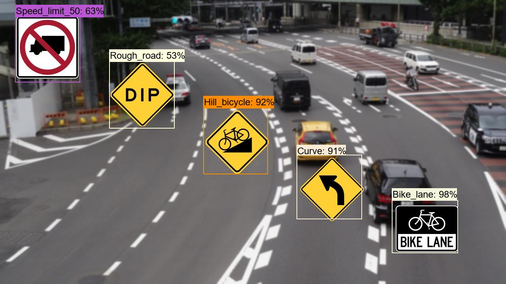 
<a  href="./projects/USA_RoadSigns/usa_virtual_test_datasset_outputs/roadsigns105.jpg_objects.csv">roadsigns105.jpg_objects.csv</a> 
 
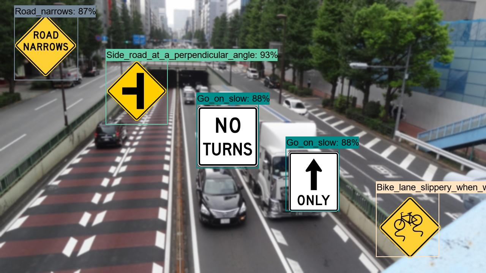 
<a  href="./projects/USA_RoadSigns/usa_virtual_test_datasset_outputs/roadsigns106.jpg_objects.csv">roadsigns106.jpg_objects.csv</a> 
 
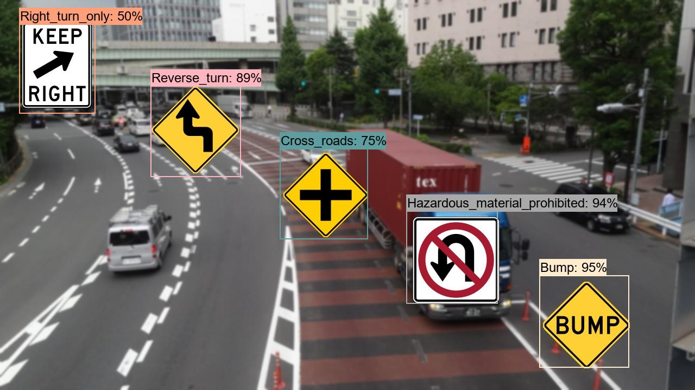 
<a  href="./projects/USA_RoadSigns/usa_virtual_test_datasset_outputs/roadsigns107.jpg_objects.csv">roadsigns107.jpg_objects.csv</a> 
 
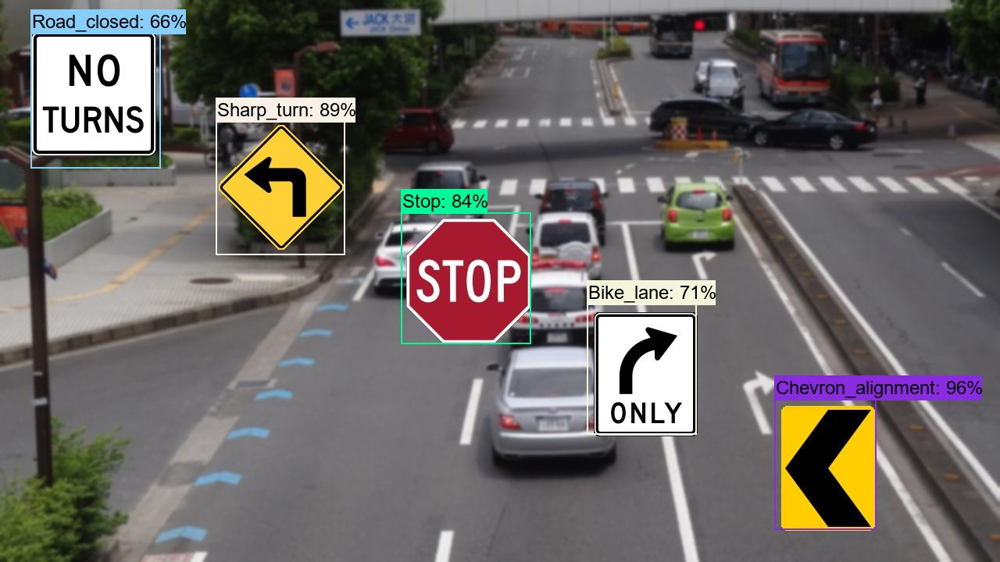 
<a  href="./projects/USA_RoadSigns/usa_virtual_test_datasset_outputs/roadsigns108.jpg_objects.csv">roadsigns108.jpg_objects.csv</a> 
 
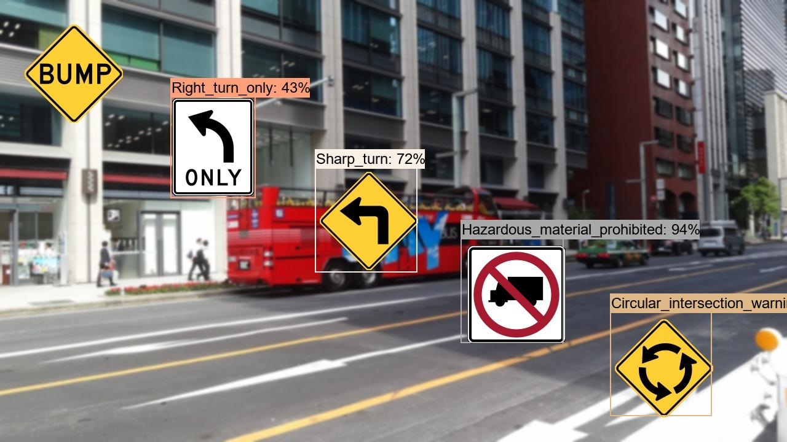 
<a  href="./projects/USA_RoadSigns/usa_virtual_test_datasset_outputs/roadsigns109.jpg_objects.csv">roadsigns109.jpg_objects.csv</a> 
 
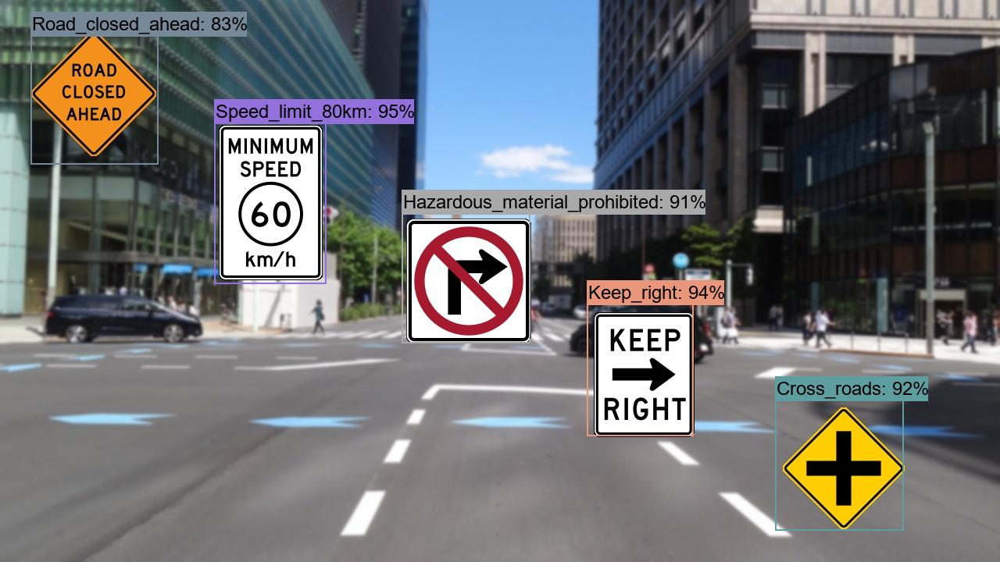 
<a  href="./projects/USA_RoadSigns/usa_virtual_test_datasset_outputs/roadsigns110.jpg_objects.csv">roadsigns110.jpg_objects.csv</a> 
 
