# EfficientDet-USA-RoadSigns-86classes
Training and detection RoadSigns in US by EfficientDet

<h2>
EfficientDet USA RoadSigns 86classes (Updated: 2022/06/18)
</h2>

This is a simple python example to train and detect RoadSigns in US based on 
<a href="https://github.com/google/automl/tree/master/efficientdet">Google Brain AutoML efficientdet</a>.
<li>
Modified to use tensorflow 2.8.0 on Windows11. (2022/06/17) 
</li>
<li>
Modified to use the latest <a href="https://github.com/google/automl/tree/master/efficientdet">google/automl/efficientdet</a>.(2022/06/13) 
</li>

<li>
Modified to use the bat files in ./projects/USA_RoadSigns/.(2022/06/14) 
</li>

<h2>
1. Installing tensorflow on Windows11
</h2>
We use Python 3.8.10 to run tensoflow 2.8.0 on Windows11. 
<h3>1.1 Install Microsoft Visual Studio Community</h3>
Please install <a href="https://visualstudio.microsoft.com/ja/vs/community/">Microsoft Visual Studio Community</a>, 
which can be used to compile source code of 
<a href="https://github.com/cocodataset/cocoapi">cocoapi</a> for PythonAPI. 
<h3>1.2 Create a python virtualenv </h3>
Please run the following command to create a python virtualenv of name <b>py38-efficientdet</b>.
<pre>
>cd c:\
>python38\python.exe -m venv py38-efficientdet
>cd c:\py38-efficientdet
>./scripts/activate
</pre>
<h3>1.3 Create a working folder </h3>
Please create a working folder "c:\google" for your repository, and install the python packages. 

<pre>
>mkdir c:\google
>cd    c:\google
>pip install cython
>git clone https://github.com/cocodataset/cocoapi
>cd cocoapi/PythonAPI
</pre>
You have to modify extra_compiler_args in setup.py in the following way:
<pre>
   extra_compile_args=[]
</pre>
<pre>
>python setup.py build_ext install
</pre>

 

 
<h2>
2. Installing EfficientDet-USA-RoadSigns
</h2>
<h3>2.1 clone EfficientDet-USA-RoadSigns-86classes</h3>

Please clone EfficientDet-USA-RoadSigns-86classes in the working folder <b>c:\google</b>. 
<pre>
>git clone  https://github.com/atlan-antillia/EfficientDet-USA-RoadSigns-86classes.git 
</pre>
You can see the following folder <b>projects</b> in  EfficientDet-USA-RoadSigns-86classes folder of the working folder. 

<pre>
EfficientDet-USA-RoadSigns-86classes
└─projects
    └─USA_RoadSigns
        ├─eval
        ├─saved_model
        │  └─variables
        ├─realistic-test-dataset
        ├─realistic-test-dataset_outputs        
        ├─train
        └─valid
</pre>
 
<h3>2.2 Install python packages</h3>

Please run the following command to install python packages for this project. 
<pre>
>cd ./EfficientDet-USA-RoadSigns-86classes
>pip install -r requirements.txt
</pre>
<h3>2.3 Workarounds for Windows</h3>
As you know or may not know, the efficientdet scripts of training a model and creating a saved_model do not 
run well on Windows environment in case of tensorflow 2.8.0(probably after the version 2.5.0) as shown below:. 
<pre>
INFO:tensorflow:Saving checkpoints for 0 into ./models\model.ckpt.
I0609 06:22:50.961521  3404 basic_session_run_hooks.py:634] Saving checkpoints for 0 into ./models\model.ckpt.
2022-06-09 06:22:52.780440: W tensorflow/core/framework/op_kernel.cc:1745] OP_REQUIRES failed at save_restore_v2_ops.cc:110 :
 NOT_FOUND: Failed to create a NewWriteableFile: ./models\model.ckpt-0_temp\part-00000-of-00001.data-00000-of-00001.tempstate8184773265919876648 :
</pre>

The real problem seems to happen in the original <b> save_restore_v2_ops.cc</b>. The simple workarounds to the issues are 
to modify the following tensorflow/python scripts in your virutalenv folder. 
<pre>
c:\py38-efficientdet\Lib\site-packages\tensorflow\python\training
 +- basic_session_run_hooks.py
 
634    logging.info("Saving checkpoints for %d into %s.", step, self._save_path)
635    ### workaround date="2022/06/18" os="Windows"
636    import platform
637    if platform.system() == "Windows":
638      self._save_path = self._save_path.replace("/", "\\")
639    #### workaround
</pre>

<pre>
c:\py38-efficientdet\Lib\site-packages\tensorflow\python\saved_model
 +- builder_impl.py

595    variables_path = saved_model_utils.get_variables_path(self._export_dir)
596    ### workaround date="2022/06/18" os="Windows" 
597    import platform
598    if platform.system() == "Windows":
599      variables_path = variables_path.replace("/", "\\")
600    ### workaround
</pre>

 

<h3>3. Inspect tfrecord</h3>
 Move to ./projects/USA_RoadSigns directory, expand train/train.7z and valid/valid.7z, 
 and run the following bat file to inspect train/train.tfrecord:
<pre>
tfrecord_inspect.bat
</pre>
, which is the following:
<pre>
python ../../TFRecordInspector.py ^
  ./train/*.tfrecord ^
  ./label_map.pbtxt ^
  ./Inspector/train
</pre>
 
This will generate annotated images with bboxes and labels from the tfrecord, and cout the number of annotated objects in it. 
 
<b>TFRecordInspecotr: annotated images in train.tfrecord</b> 

 
 
<b>TFRecordInspecotr: objects_count train.tfrecord</b> 
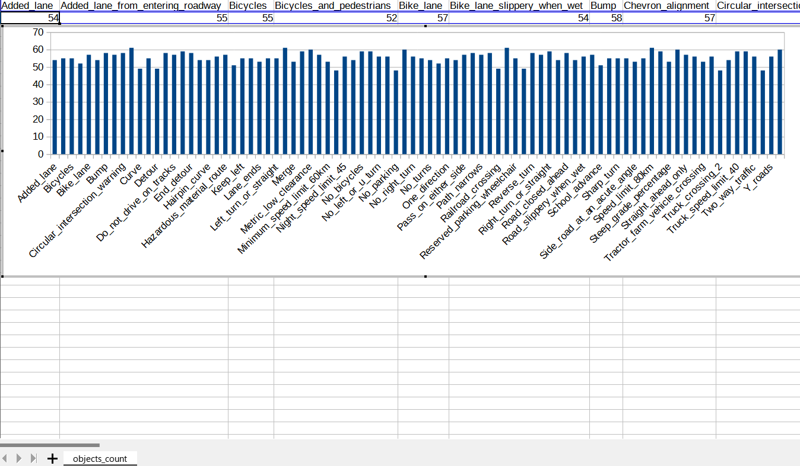
 
This bar graph shows that the number of the objects.
 
 
 
<h3>4. Downloading the pretrained-model efficientdet-d0</h3>
Please download an EfficientDet model chekcpoint file <b>efficientdet-d0.tar.gz</b>, and expand it in <b>EfficientDet-USA-RoadSigns</b> folder. 
 
https://storage.googleapis.com/cloud-tpu-checkpoints/efficientdet/coco2/efficientdet-d0.tar.gz
 
See: https://github.com/google/automl/tree/master/efficientdet 

<h3>5. Training USA RoadSigns Model by using pretrained-model</h3>
Move to the ./projects/USA_RoadSigns directory, and run the following bat file to train roadsigns efficientdet model:
<pre>
1_train.bat
</pre> 
, which is the following:
<pre>
python ../../ModelTrainer.py ^
  --mode=train_and_eval ^
  --train_file_pattern=./train/train.tfrecord  ^
  --val_file_pattern=./valid/valid.tfrecord ^
  --model_name=efficientdet-d0 ^
  --hparams="input_rand_hflip=False,image_size=512,num_classes=86,label_map=./label_map.yaml" ^
  --model_dir=./models ^
  --label_map_pbtxt=./label_map.pbtxt ^
  --eval_dir=./eval ^
  --ckpt=../../efficientdet-d0  ^
  --train_batch_size=4 ^
  --early_stopping=map ^
  --patience=10 ^
  --eval_batch_size=4 ^
  --eval_samples=600  ^
  --num_examples_per_epoch=1000 ^
  --num_epochs=100   

</pre>

<table style="border: 1px solid #000;">
<tr>
<td>
--mode</td><td>train_and_eval</td>
</tr>
<tr>
<td>
--train_file_pattern</td><td>./train/train.tfrecord</td>
</tr>
<tr>
<td>
--val_file_pattern</td><td>./valid/valid.tfrecord</td>
</tr>
<tr>
<td>
--model_name</td><td>efficientdet-d0</td>
</tr>
<tr><td>
--hparams</td><td>"input_rand_hflip=False,image_size=512,num_classes=86,label_map=./label_map.yaml"
</td></tr>
<tr>
<td>
--model_dir</td><td>./models</td>
</tr>
<tr><td>
--label_map_pbtxt</td><td>./label_map.pbtxt
</td></tr>

<tr><td>
--eval_dir</td><td>./eval
</td></tr>

<tr>
<td>
--ckpt</td><td>../../efficientdet-d0</td>
</tr>
<tr>
<td>
--train_batch_size</td><td>4</td>
</tr>
<tr>
<td>
--early_stopping</td><td>map</td>
</tr>
<tr>
<td>
--patience</td><td>10</td>
</tr>

<tr>
<td>
--eval_batch_size</td><td>4</td>
</tr>
<tr>
<td>
--eval_samples</td><td>600</td>
</tr>
<tr>
<td>
--num_examples_per_epoch</td><td>1000</td>
</tr>
<tr>
<td>
--num_epochs</td><td>100</td>
</tr>
</table>
 
 
<b>label_map.yaml (Updated: 2022/06/14)</b>
<pre>
1: 'Added_lane'
2: 'Added_lane_from_entering_roadway'
3: 'Bicycles'
4: 'Bicycles_and_pedestrians'
5: 'Bike_lane'
6: 'Bike_lane_slippery_when_wet'
7: 'Bump'
8: 'Chevron_alignment'
9: 'Circular_intersection_warning'
10: 'Cross_roads'
11: 'Curve'
12: 'Deer_crossing'
13: 'Detour'
14: 'Dip'
15: 'Do_not_enter'
16: 'Do_not_drive_on_tracks'
17: 'End_detour'
18: 'Go_on_slow'
19: 'Hairpin_curve'
20: 'Hazardous_material_prohibited'
21: 'Hazardous_material_route'
22: 'Hill_bicycle'
23: 'Keep_left'
24: 'Keep_right'
25: 'Lane_ends'
26: 'Left_turn_only'
27: 'Left_turn_or_straight'
28: 'Low_clearance'
29: 'Merge'
30: 'Merging_traffic'
31: 'Metric_low_clearance'
32: 'Minimum_speed_limit_40'
33: 'Minimum_speed_limit_60km'
34: 'Narrow_bridge'
35: 'Night_speed_limit_45'
36: 'Night_speed_limit_70km'
37: 'No_bicycles'
38: 'No_large_trucks'
39: 'No_left_or_u_turn'
40: 'No_left_turn'
41: 'No_parking'
42: 'No_pedestrian_crossing'
43: 'No_right_turn'
44: 'No_straight_through'
45: 'No_turns'
46: 'No_u_turn'
47: 'One_direction'
48: 'Parking_with_time_restrictions'
49: 'Pass_on_either_side'
50: 'Pass_road'
51: 'Path_narrows'
52: 'Pedestrian_crossing'
53: 'Railroad_crossing'
54: 'Railroad_crossing_ahead'
55: 'Reserved_parking_wheelchair'
56: 'Reverse_curve'
57: 'Reverse_turn'
58: 'Right_turn_only'
59: 'Right_turn_or_straight'
60: 'Road_closed'
61: 'Road_closed_ahead'
62: 'Road_narrows'
63: 'Road_slippery_when_wet'
64: 'Rough_road'
65: 'School_advance'
66: 'School_bus_stop_ahead'
67: 'Sharp_turn'
68: 'Side_road_at_an_acute_angle'
69: 'Side_road_at_a_perpendicular_angle'
70: 'Speed_limit_50'
71: 'Speed_limit_80km'
72: 'Steep_grade'
73: 'Steep_grade_percentage'
74: 'Stop'
75: 'Straight_ahead_only'
76: 'Tractor_farm_vehicle_crossing'
77: 'Truck_crossing'
78: 'Truck_crossing_2'
79: 'Truck_rollover_warning'
80: 'Truck_speed_limit_40'
81: 'Two_direction'
82: 'Two_way_traffic'
83: 'T_roads'
84: 'Winding_road'
85: 'Yield'
86: 'Y_roads'
</pre>
 
<b>Training console output at epoch 100</b>
 
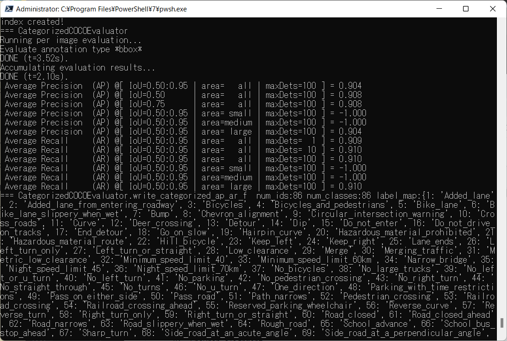
 
 
<b><a href="./projects/USA_RoadSigns/eval/coco_metrics.csv">COCO meticss</a></b> 
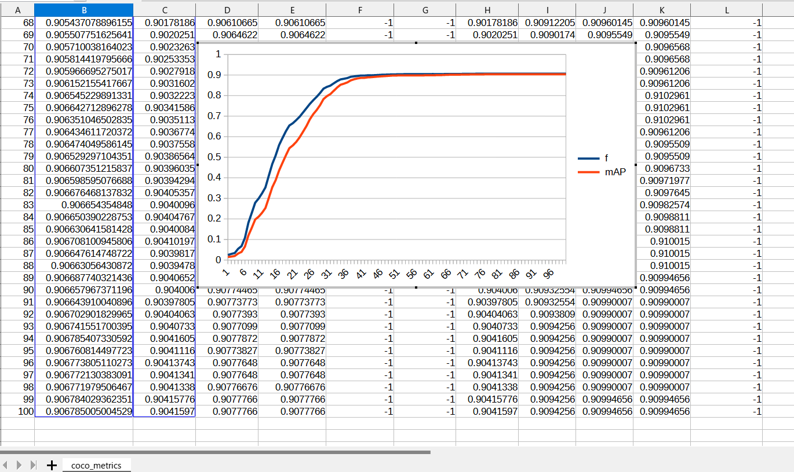
 
 
<b><a href="./projects/USA_RoadSigns/eval/train_losses.csv">Train losses</a></b> 
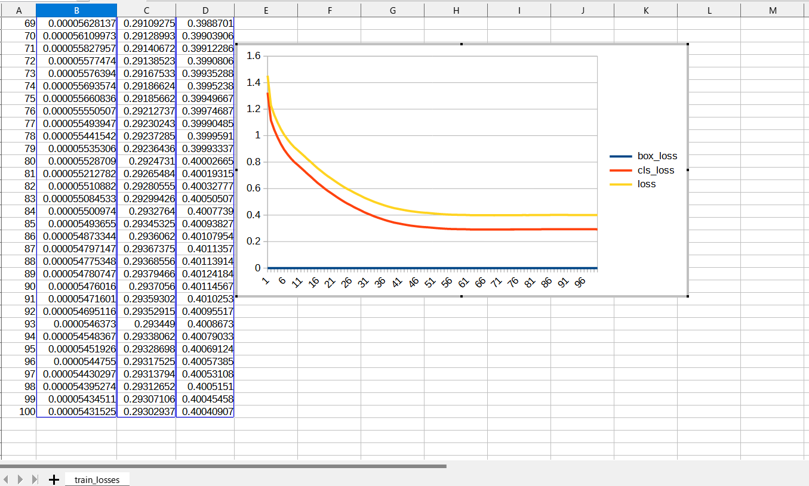
 
 

<b><a href="./projects/USA_RoadSigns/eval/coco_ap_per_class.csv">COCO ap per class</a></b> 
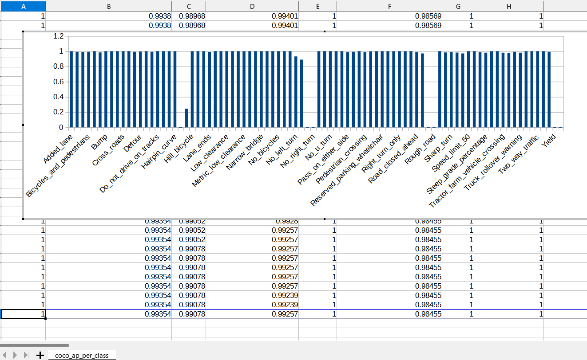
 
 
<h3>
6. Create a saved_model from the checkpoint
</h3>
 Please run the following bat file to create a saved model from a chekcpoint in models folder.
<pre>
2_create_saved_model.bat
</pre>
, which is the following:
<pre>
python ../../SavedModelCreator.py ^
  --runmode=saved_model ^
  --model_name=efficientdet-d0 ^
  --ckpt_path=./models  ^
  --hparams="image_size=512x512,num_classes=86" ^
  --saved_model_dir=./saved_model
</pre>

<table style="border: 1px solid #000;">
<tr>
<td>--runmode</td><td>saved_model</td>
</tr>

<tr>
<td>--model_name </td><td>efficientdet-d0 </td>
</tr>

<tr>
<td>--ckpt_path</td><td>./models</td>
</tr>

<tr>
<td>--hparams</td><td>"image_size=512x512,num_classes=86"</td>
</tr>

<tr>
<td>--saved_model_dir</td><td>./saved_model</td>
</tr>
</table>

 
 
<h3>
7. Inference USA_RoadSigns by using the saved_model
</h3>
 Please run the following bat file to infer the roadsigns by using the saved_model:
<pre>
</pre>
, which is the following:
<pre>
python ../../SavedModelInferencer.py ^
  --runmode=saved_model_infer ^
  --model_name=efficientdet-d0 ^
  --saved_model_dir=./saved_model ^
  --min_score_thresh=0.4 ^
  --hparams="label_map=./label_map.yaml" ^
  --input_image=./realistic_test_dataset/*.jpg ^
  --classes_file=./classes.txt ^
  --ground_truth_json=./realistic_test_dataset/annotation.json ^
  --output_image_dir=./realistic_test_dataset_outputs
</pre>

<table style="border: 1px solid #000;">
<tr>
<td>--runmode</td><td>saved_model_infer </td>
</tr>

<tr>
<td>--model_name</td><td>efficientdet-d0 </td>
</tr>

<tr>
<td>--saved_model_dir</td><td>./saved_model </td>
</tr>

<tr>
<td>--min_score_thresh</td><td>0.4 </td>
</tr>

<tr>
<td>--hparams</td><td>"label_map=./label_map.yaml"</td>
</tr>

<tr>
<td>--input_image</td><td>./realistic_test_dataset/*.jpg</td>
</tr>

<tr>
<td>--classes_file</td><td>./classes.txt</td>
</tr>
<tr>
<td>--ground_truth_json</td><td>./realistic_test_dataset/annotation.json</td>
</tr>

<tr>
<td>--output_image_dir</td><td>./realistic_test_dataset_outputs</td>
</tr>
</table>
 
<h3>
8. Some inference results of USA RoadSigns
</h3>

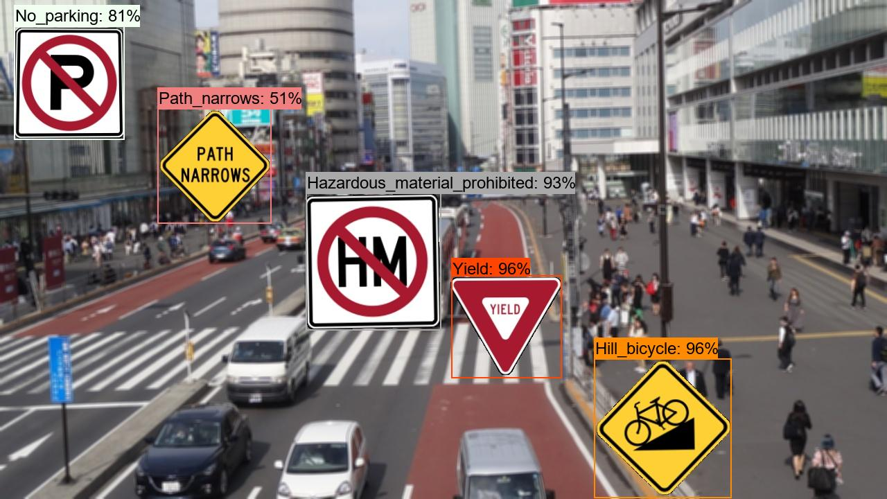 
<a href="./projects/USA_RoadSigns/realistic_test_dataset_outputs/usa_roadsigns_1000.jpg_objects.csv">roadsigns_1.jpg_objects.csv</a> 

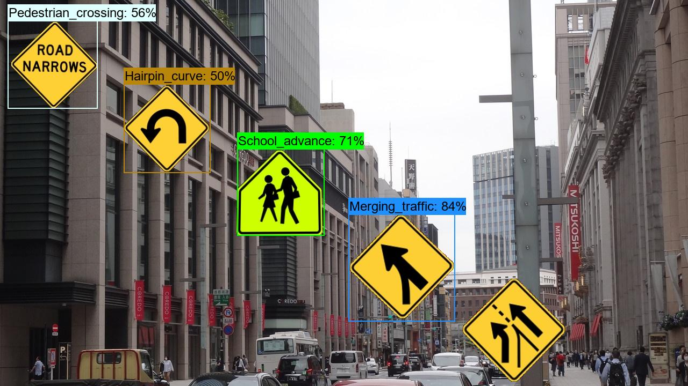 
<a  href="./projects/USA_RoadSigns/realistic_test_dataset_outputs/usa_roadsigns_1020.jpg_objects.csv">roadsigns_2.jpg_objects.csv</a> 

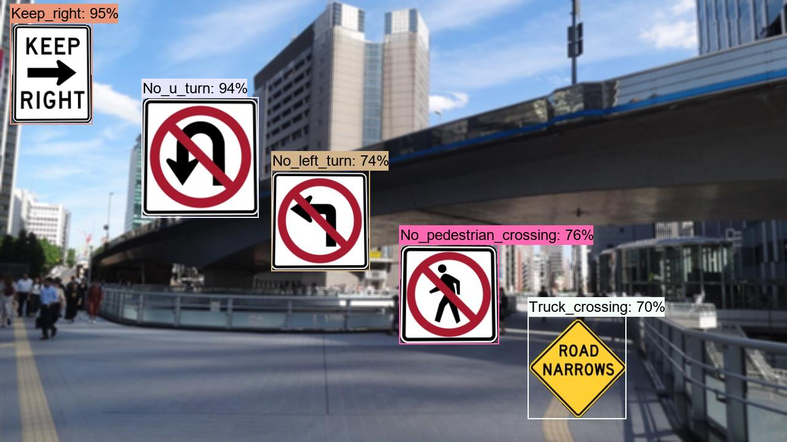 
<a  href="./projects/USA_RoadSigns/realistic_test_dataset_outputs/usa_roadsigns_1030.jpg_objects.csv">roadsigns_3.jpg_objects.csv</a> 

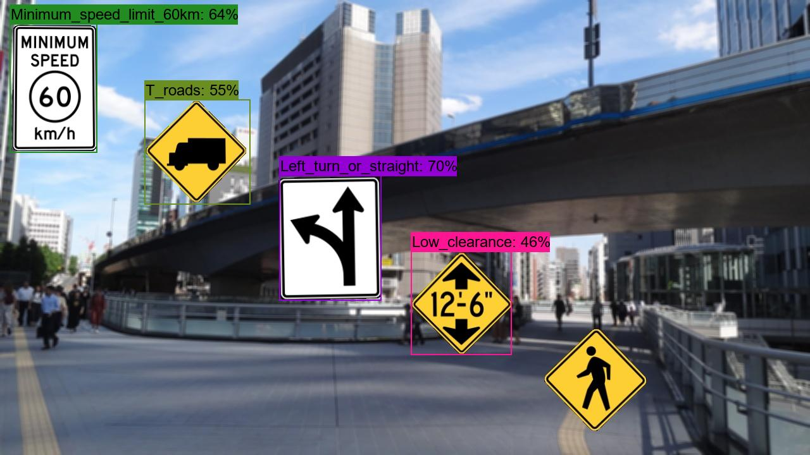 
<a  href="./projects/USA_RoadSigns/realistic_test_dataset_outputs/usa_roadsigns_1040.jpg_objects.csv">roadsigns_4.jpg_objects.csv</a> 

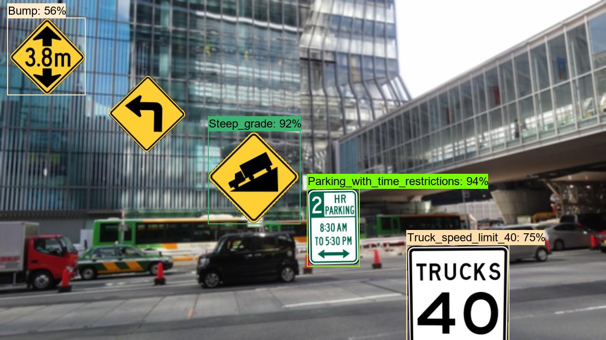 
<a  href="./projects/USA_RoadSigns/realistic_test_dataset_outputs/usa_roadsigns_1050.jpg_objects.csv">roadsigns_5.jpg_objects.csv</a> 

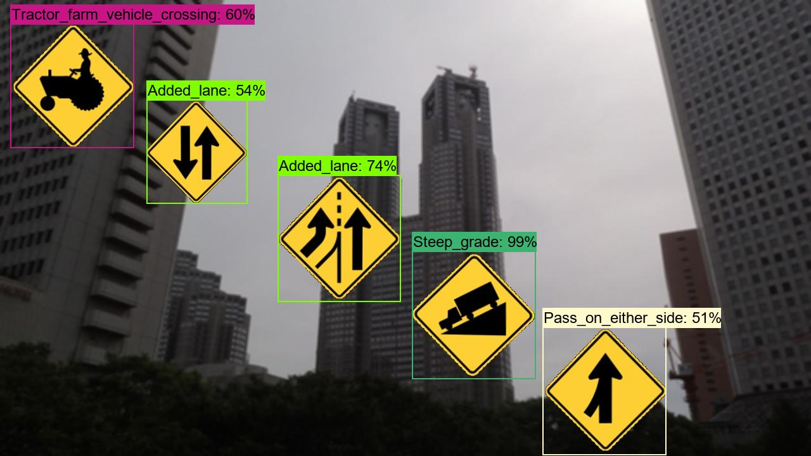 
<a  href="./projects/USA_RoadSigns/realistic_test_dataset_outputs/usa_roadsigns_1060.jpg_objects.csv">roadsigns_6.jpg_objects.csv</a> 

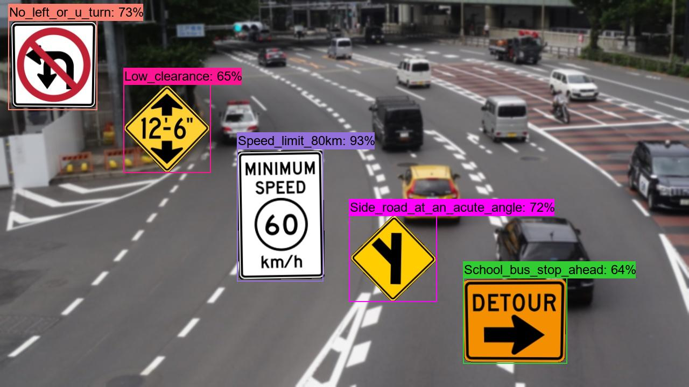 
<a  href="./projects/USA_RoadSigns/realistic_test_dataset_outputs/usa_roadsigns_1070.jpg_objects.csv">roadsigns_7.jpg_objects.csv</a> 

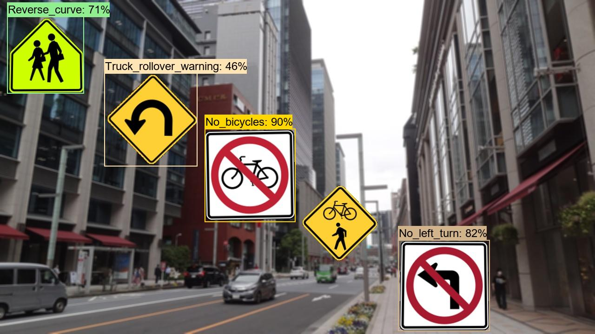 
<a  href="./projects/USA_RoadSigns/realistic_test_dataset_outputs/usa_roadsigns_1080.jpg_objects.csv">roadsigns_8.jpg_objects.csv</a> 

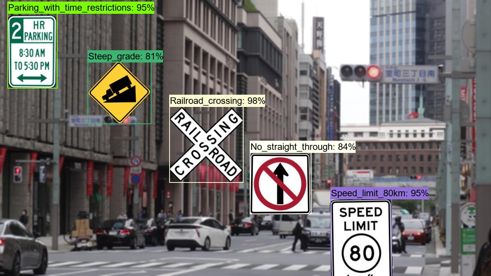 
<a  href="./projects/USA_RoadSigns/realistic_test_dataset_outputs/usa_roadsigns_1090.jpg_objects.csv">roadsigns_9.jpg_objects.csv</a> 

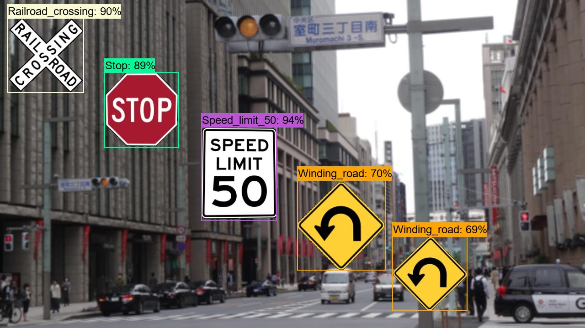 
<a  href="./projects/USA_RoadSigns/realistic_test_dataset_outputs/usa_roadsigns_1099.jpg_objects.csv">roadsigns_10.jpg_objects.csv</a> 

<h3>9. COCO metrics of inference result</h3>
The 3_inference.bat computes also the COCO metrics(f, map, mar) to the <b>realistic_test_dataset</b> as shown below: 

<a href="./projects/USA_RoadSigns/realistic_test_dataset_outputs/prediction_f_map_mar.csv">prediction_f_map_mar.csv</a>

 
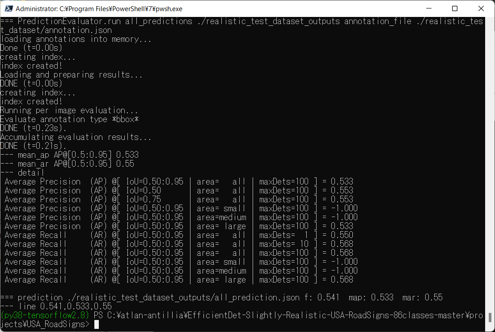 

